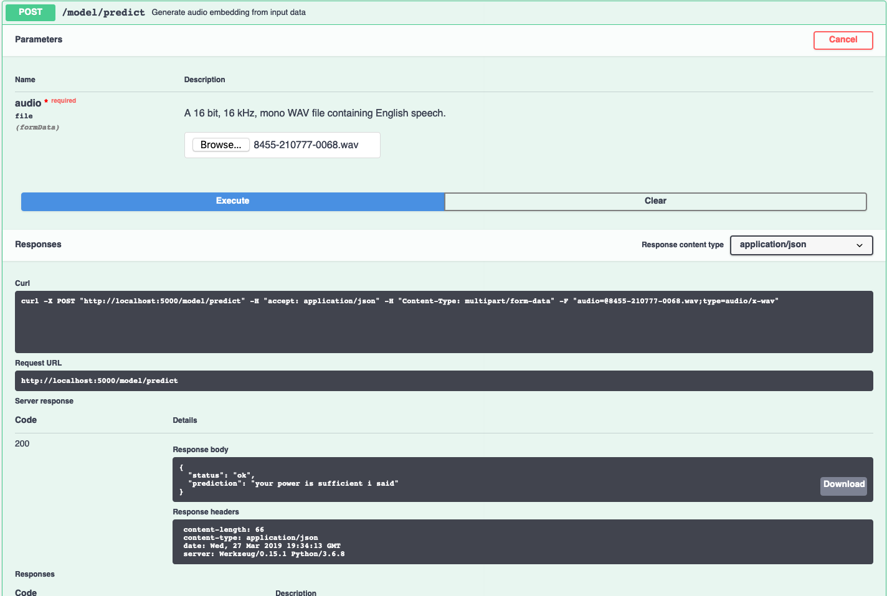

[](https://travis-ci.com/IBM/MAX-Speech-To-Text-Converter)
[](http://max-speech-to-text-converter.codait-prod-41208c73af8fca213512856c7a09db52-0000.us-east.containers.appdomain.cloud)

[](http://ibm.biz/max-to-ibm-cloud-tutorial) 

# IBM Developer Model Asset Exchange: Speech to Text Converter

This repository contains code to instantiate and deploy a speech recognition model. The model takes a short (~5 second),
single channel `WAV` file containing English language speech as an input and returns a string containing the predicted
speech.

The model expects 16kHz audio, but will resample the input if it is not already 16kHz. Note this will likely negatively
impact the accuracy of the model.

The code for this model comes from Mozilla's [Project DeepSpeech](https://github.com/mozilla/DeepSpeech) and is based
on [Baidu's Deep Speech research paper](https://arxiv.org/abs/1412.5567).


The model files are hosted on
[IBM Cloud Object Storage](https://max-cdn.cdn.appdomain.cloud/max-speech-to-text-converter/1.0.0/assets.tar.gz).
The code in this repository deploys the model as a web service in a Docker container. This repository was developed as
[IBM Code Model Asset Exchange](https://developer.ibm.com/code/exchanges/models/) and the public API is powered by
[IBM Cloud](https://ibm.biz/Bdz2XM).

## Model Metadata
| Domain | Application | Industry  | Framework | Training Data | Input Data Format |
| ------------- | --------  | -------- | --------- | --------- | -------------- | 
| Audio | Speech Recognition | General | TensorFlow | Mozilla Common Voice | Audio (16 bit, 16 kHz, mono WAV file)| 

## References

* _Awni Hannun, Carl Case, Jared Casper, Bryan Catanzaro, Greg Diamos, Erich Elsen, Ryan Prenger, Sanjeev Satheesh, Shubho Sengupta, Adam Coates, Andrew Y. Ng_, ["Deep Speech: Scaling up end-to-end speech recognition"](https://arxiv.org/abs/1412.5567), arXiv:1412.5567
* [Mozilla DeepSpeech](https://github.com/mozilla/DeepSpeech)

## Licenses

| Component | License | Link  |
| ------------- | --------  | -------- |
| This repository | [Apache 2.0](https://www.apache.org/licenses/LICENSE-2.0) | [LICENSE](LICENSE) |
| Model Weights | [Mozilla Public License 2.0](https://www.mozilla.org/en-US/MPL/2.0/) | [Mozilla DeepSpeech](https://github.com/mozilla/DeepSpeech#getting-the-pre-trained-model)|
| Model Code (3rd party) | [Mozilla Public License 2.0](https://www.mozilla.org/en-US/MPL/2.0/) | [DeepSpeech LICENSE](https://github.com/mozilla/DeepSpeech/blob/master/LICENSE)|
| Test Samples | Various | [Asset README](samples/README.md) |

## Pre-requisites:

* `docker`: The [Docker](https://www.docker.com/) command-line interface. Follow the [installation instructions](https://docs.docker.com/install/) for your system.
* The minimum recommended resources for this model is 2GB Memory and 2 CPUs.

# Deployment options

* [Deploy from Docker Hub](#deploy-from-docker-hub)
* [Deploy on Red Hat OpenShift](#deploy-on-red-hat-openshift)
* [Deploy on Kubernetes](#deploy-on-kubernetes)
* [Run Locally](#run-locally)

## Deploy from Docker Hub

To run the docker image, which automatically starts the model serving API, run:

```
$ docker run -it -p 5000:5000 quay.io/codait/max-speech-to-text-converter
```

This will pull a pre-built image from Docker Hub (or use an existing image if already cached locally) and run it.
If you'd rather checkout and build the model locally you can follow the [run locally](#run-locally) steps below.

## Deploy on Red Hat OpenShift

You can deploy the model-serving microservice on Red Hat OpenShift by following the instructions for the OpenShift web console or the OpenShift Container Platform CLI [in this tutorial](https://developer.ibm.com/tutorials/deploy-a-model-asset-exchange-microservice-on-red-hat-openshift/), specifying `quay.io/codait/max-speech-to-text-converter` as the image name.

## Deploy on Kubernetes

You can also deploy the model on Kubernetes using the latest docker image on Docker Hub.

On your Kubernetes cluster, run the following commands:

```
$ kubectl apply -f https://raw.githubusercontent.com/IBM/max-speech-to-text-converter/master/max-speech-to-text-converter.yaml
```

The model will be available internally at port `5000`, but can also be accessed externally through the `NodePort`.

## Run Locally

1. [Build the Model](#1-build-the-model)
2. [Deploy the Model](#2-deploy-the-model)
3. [Use the Model](#3-use-the-model)
4. [Development](#4-development)
5. [Cleanup](#5-cleanup)

### 1. Build the Model

Clone this repository locally. In a terminal, run the following command:

```
$ git clone https://github.com/IBM/max-speech-to-text-converter.git
```

Change directory into the repository base folder:

```
$ cd max-speech-to-text-converter
```

To build the docker image locally, run: 

```
$ docker build -t max-speech-to-text-converter .
```

All required model assets will be downloaded during the build process. _Note_ that currently this docker image is CPU
only (we will add support for GPU images later).


### 2. Deploy the Model

To run the docker image, which automatically starts the model serving API, run:

```
$ docker run -it -p 5000:5000 max-speech-to-text-converter
```

### 3. Use the Model

The API server automatically generates an interactive Swagger documentation page. Go to `http://localhost:5000` to load
it. From there you can explore the API and also create test requests.

Use the `model/predict` endpoint to load a test audio file (you can use one of the test audio files from the `samples`
folder) and get predicted text from the API.



You can also test it on the command line, for example:

```bash
$ curl -F "audio=@samples/8455-210777-0068.wav" -X POST http://localhost:5000/model/predict
```

You should see a JSON response like that below:

```json
{"status": "ok", "prediction": "your power is sufficient i said"}
```

### 4. Development

To run the Flask API app in debug mode, edit `config.py` to set `DEBUG = True` under the application settings. You will
then need to rebuild the docker image (see [step 1](#1-build-the-model)).

### 5. Cleanup

To stop the Docker container, type `CTRL` + `C` in your terminal.

## Resources and Contributions
   
If you are interested in contributing to the Model Asset Exchange project or have any queries, please follow the instructions [here](https://github.com/CODAIT/max-central-repo).
